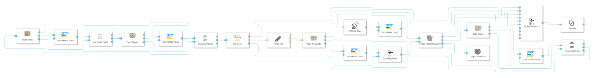
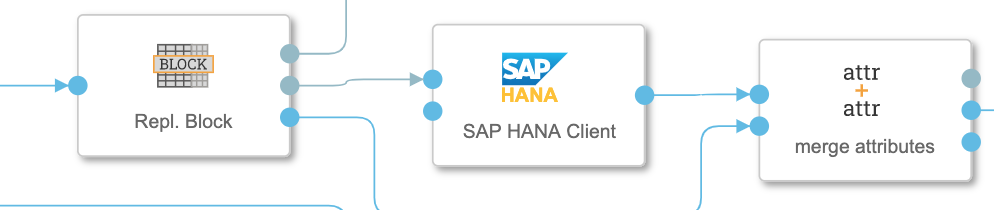
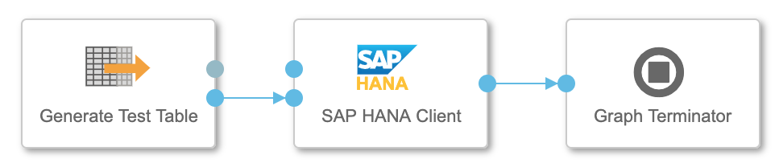
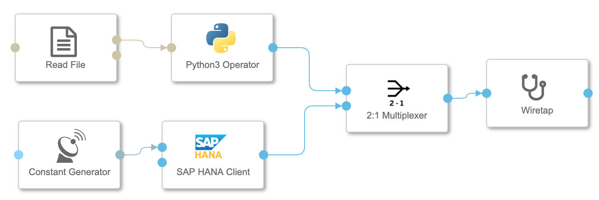

# SQL DB to Object Store Replication
(sdi_replication) by thhapke

##Summary 
If there is a requirement to securely replicate a table to an object store this project description and the operators could help you. The original request came from a customer who wants to replicate their ECC/S4 tables to an Azure Data Lake. For the time being that the SLT - SAP DI connection is not general available (planned for Q1 2021) the replication could be done to an HANA DB and from their picked up by the following pipeline. 

## DB to Object Store Mapping Strategy
The low storage cost of an object store is traded for less flexibility, more precisely you cannot as easily as with a database udpate changed data records to csv-files. My proposal is a 2-way approach: Changes are tagged as 'I' for inserts that can right away been appended to an CSV while for updates or deletes tagged as 'U' change-log files are stored and periodically are merged with the basic CSV file. 

## Replication Control Information
In order to securely replicate data, additional control data is needed. This additional information could either be stored to **additional columns** of the data table or as a separate **shadow table** with a foreign key to the data table. Instead of providing a table a view with the joins could be provided.  

The minimum replication controll data:

* **DIREPL_STATUS** Replication Status (Wait, Blocked, Completed)
* **DIREPL_TYPE** Insert, Update, Delete
* **DIREPL_UPDATED** UTC Timestamp of last update
* **DIREPL_PACKAGEID** (optional) Generated by customized SLT script for batch process. This could also be set with DI by an additional preparation step or added to the sql-statement (repl_block-operator) with the *TOP* modfier. 
* **DIREPL_PID** Process ID provided by DI pipeline

## General Process

The general process is basically a sequence of **sql-statement** producer and **SAP HANA Client**-operator finally the **write-File** operation to the **object-store*. The **sql-statement** producer are wrapped into simple custom python operators that most probably will be replaced by standard operators (most likely *structured data operators*) of the next releases. 

1. **Table Dispatcher** gets the tables to be replicated from a table and sends them successively to the output port. It also gets from another input port the messages from processed table packages. It checks if any changes in the table has been detected. If there has been no changes the replication process could stop if the parameter 'Round trips to stop' is set. 
2. **Reset** After a certain define period (latency provided with the table data) the 'blocked' data is again released to be processed in the loop. The reason for not been processed might been a broken pipeline. 
2. **Block** Blocks all records of the lowest 'package Id' waiting to be processed. The blocked records are also updated with an 'pid' (random number provided by DI) 
3. **Select** Selects all blocked records/packageid of this process ('pid')
4. **json-dict** Converts the data of json-format into an csv-format. This could be changed to any other format. Configurable if the replication data should also be stored. 
5. **Write-File** Writes data to the object store. This should be configured either as 'append' or as 'overwrite'. For the later the packageid should be part of the filename to keep the order of the changes. 
5. **Complete** Sets the blocked packageids to 'complete'.

Because the *HANA Client Operator* is not passing the message attributes (It receives only an sql-statement as a string at the sql-inport) the attributes has been passed over to the next operators. The operator 'Merge Attributes' is just doing what the title promises and passed to the next 'executing' operator. 

## Configuration
The configuration of the replication process is rather simple. 

### Input
The input data are the tables/views to be replicated and they are provided by a table that consists at least of two columns: 

* table name (including the schema)
* latency (seconds)

The latency determines the release on the package blocking due to the assumption that this is longer than the maximum of the process time for each package. 

### Parameter
The configuration 

* **TABLES SQL** (Constant Generator) 
	* SQL Statement for providing the tables that should be replicated
* **Repl Table Dispatcher** (Python Custom Operator) 
	* **Periodicity** Idle time between each loop iteration in case no table changes could be detected
	* **Fraction of tables to parallelize** Instead of waiting until the replication of a table package has been processed, a number of packages can already funneled into the pipeline. The maximum number are restricted by the number of tables. Fraction of '1' means that packages run in parallel is the number of tables.
	* **Roundtrips to stop** If this number of loops has been run through while no data has been processed the pipeline stops. This can be used to schedule the replication e.g. on an hourly basis. If there are no changes then no computing resources are used unnecessarily. In times of high data volume multiple replication pipelines can be started which stops when their duty has been fulfilled. 
	*  **Insert ('I') or update ('U')** Determines if this pipeline is an "Appending" or a "Change-Log" one. This parameter is just an additional WHERE-constraint to the data selection. This has to correspond to the "Write File"-configuration. 
* **Write-File** (Write File)
	* **Connection** to the object store
	* **Path Mode** if placeholders should be used. In particular usefull for writing the "Change-Log" files
	* **Path** the location of the file. For the "Change-log"-type placeholders could be used like /replication/change_log/<header:base_replication_table>/<header:base_replication_table>_<header:packageid>.csv
	* **Mode** Depending on the type of replication either Overwrite/Create or Append needs to be set. 


## Parallelization
The pipeline is designed to run through a loop of all provided tables and process one packageID in each step. That means one pipeline can cover as many tables as been given by the 'tables'-table provided to the 'Table Dispatcher'-operator. The replication process can be accelerated by processing multiple table at once. This means that up to the number of tables, messages are being sent through the pipeline shortly one after the other and it is not been waited until a table package has been processed entirely. This results into a 40% performance gain. 

## Graph
The graph looks quite complex and and long but it is when you break it up into the basic steps described in the section "General Process". 
.

The 4 sql-statments have the same structure and consists of the

* **ql-statement producers** ('repl\_reset', 'repl\_block', 'repl\_select' and 'repl\_complete
* **SAP HANA Client** operator
* **merge attributes** operator



it is easy to comprehend. 

The code of the sql-statement producer are all quite similiar and the core of it is the generated sql-statement code: 

```
    update_sql = 'UPDATE {table} SET \"DIREPL_STATUS\" = \'B\', \"DIREPL_PID\" = \'{pid}\', '\
                 '\"DIREPL_UPDATED\" =  CURRENT_UTCTIMESTAMP WHERE ' \
                 '\"DIREPL_PACKAGEID\" = (SELECT min(\"DIREPL_PACKAGEID\") ' \
                 'FROM {table} WHERE \"DIREPL_STATUS\" = \'W\' AND \"DIREPL_TYPE\" = \'{ct}\')'\
				.format(table=att['table'], pid = pid,ct = change_type)
```

For an on-the-fly logging all operators catch the logging-statements and send it to a log-outport. All log-outputs are collected with an **Multiplexer** and funneld to a **wiretap**-operator.

Within one loop all the attributes carry the information that is needed to process the replication of on package of one table. Due to the parallel processing it is quite important to take care of the 'shared-by-reference' concept of python. In particular you have to hard copy each message.attribute before passing to the next step. Due to my laziness in this respect I first got literally a mixed result - files containing data from the previous or next table. 

## Operators

All operators can be do either directly imported from the github folder [operator solution](./solution/operators/) or the source-code [operator src](./src/di_replication) first tested and modified outside of DI. Then you can either copy and paste the script to the unmodified imported operator or use my gensolution script to create the solution. 

## Test

To test the replication I have created HANA - Tables of the following structure: 

```
CREATE COLUMN TABLE "REPLICATION"."TEST_TABLE0"(
	"INDEX" BIGINT,
	"INT_NUM" BIGINT,
	"DIREPL_PACKAGEID" BIGINT,
	"DIREPL_PID" BIGINT,
	"DIREPL_UPDATED" LONGDATE,
	"DIREPL_STATUS" NVARCHAR(1),
	"DIREPL_TYPE" NVARCHAR(1),
	PRIMARY KEY (
		"INDEX",
		"DIREPL_PACKAGEID"
	)
)

```

and written an operator that is generating test tables with the parameters

* number of rows
* offset of the incremental numbers in the "INT_NUM" column. 

With this the validation is quite easy, just the comparison of the number of lines of the replicated csv-file and the sum of the "INT_NUM" columns.




The test table generation and verification still needs some manual steps. For a systematic test scenario some more automation might be needed. 

A pipeline crash have I simulated by randomly stop a pipeline and restart it. 


## Performance

* 1 pipeline on Standard DI - Node 
*  HANA as a Service to ADL
* 10 Tables with 1M changes each and packages of 10 000 records

-> 15min


## Final Remarks

### Package IDs
My intuition tells be that the package IDs does not need to be provided through the preceding step. There might be an SQL-statement using the order of the "DIPREPL_UPDATED" timestamp and the TOP-modifier to do this on-the-fly. I have not been successful yet because ORDER BY and UPDATE cannot easily been used in HANA SQL. An additional sub-section SELECT with a join might solve the task. 

### Table View with Shadow-Tables or SQL-JOIN Statements

Instead of creating table views when having shadow-replication tables you could also adjust the 4 sql-statements. But in this case you need to provide for each table the primary keys what makes the setup far more complex than just creating table views. For this reason I decided against adding this as an option to the pipeline. 


